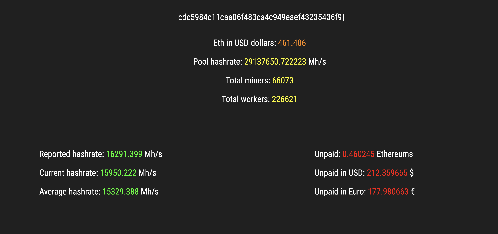

# Reading data From Ethermine API

It's a basic website that reads data from:

- https://api.coinmarketcap.com/api    (gets value of Ethereum in USD dollars and Euro)
- https://api.ethermine.org/api         

It's useful to see the hashrate, unpaid balance or the value in euros of a miner. All data is read in Json format and displayed in the Html. 

## How to observe my statics?

1 - Get your miner id of Ehtermine.org
2 - Insert it in the text box - Enter

### Example

Miner id = cdc5984c11caa06f483ca4c949eaef43235436f9

  

